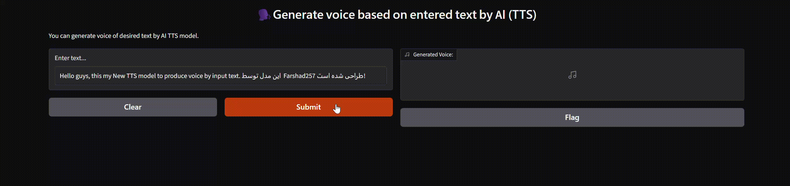

# 🗣️ AI Text-to-Speech (TTS) with Gradio

An interactive **Text-to-Speech (TTS) web application** that converts written text into natural-sounding speech using an AI TTS model and provides an easy-to-use interface built with **Gradio**.

<p align="center">
  
</p>

The application connects to an **OpenAI-compatible API endpoint provided by AvalAI**, generates speech from the user's text, saves the generated audio as an MP3 file, and makes it available directly through the web interface.

**⭕ Notice** This workflow can run by link bellow: (By prior arrangement)
https://2ad2cd507033934ca6.gradio.live/

---

## ✨ Features

- 📝 Convert text into AI-generated speech
- 🤖 Powered by an AI **Text-to-Speech model**
- 🎙️ Uses the `tts-1` model with the `alloy` voice
- 🌐 Simple and interactive **Gradio** interface
- 🔊 Built-in audio playback
- 💾 Automatically saves generated speech as an `.mp3` file
- 🔐 API key management through environment variables
- ⚡ Lightweight and easy to run locally

---

## 🏗️ Workflow

```text
        ┌─────────────────┐
        │   User Input    │
        │      Text       │
        └────────┬────────┘
                 │
                 ▼
        ┌─────────────────┐
        │    Gradio UI    │
        └────────┬────────┘
                 │
                 ▼
        ┌─────────────────┐
        │  TTS Function   │
        │ text_to_speech()│
        └────────┬────────┘
                 │
                 ▼
        ┌─────────────────┐
        │   AvalAI API    │
        │    TTS Model    │
        │     tts-1       │
        └────────┬────────┘
                 │
                 ▼
        ┌─────────────────┐
        │ Generated MP3   │
        │     Audio       │
        └────────┬────────┘
                 │
                 ▼
        ┌─────────────────┐
        │ Audio Playback  │
        │   & Download    │
        └─────────────────┘
```

---

## 🛠️ Tech Stack

| Technology | Purpose |
|---|---|
| 🐍 Python | Core programming language |
| 🎨 Gradio | Interactive web interface |
| 🤖 OpenAI Python SDK | API communication |
| 🔊 TTS | Text-to-Speech generation |
| ☁️ AvalAI API | AI model API provider |
| 🔐 python-dotenv | Environment variable management |

---

## 📂 Project Structure

```text
TTS-Workflow/
│
├── TTS_workflow.py
├── .env
├── README.md
│
└── Generated_Media/
    └── Generated_files_gradio/
        └── generated_speech.mp3
```

---

## ⚙️ Installation

### 1. Clone the repository

```bash
git clone https://github.com/YOUR_USERNAME/YOUR_REPOSITORY.git
cd YOUR_REPOSITORY
```

### 2. Create a virtual environment

```bash
python -m venv venv
```

Activate it on Windows:

```bash
venv\Scripts\activate
```

On Linux/macOS:

```bash
source venv/bin/activate
```

### 3. Install dependencies

```bash
pip install -U openai gradio python-dotenv
```

---

## 🔐 API Configuration

Create a `.env` file in the root directory:

```env
AVAL_API_KEY=your_api_key_here
```

The application loads the API key from the environment and uses it to initialize the API client.

> ⚠️ **Never commit your `.env` file or API key to GitHub.**

Add the following to `.gitignore`:

```gitignore
.env
venv/
__pycache__/
```

---

## ▶️ Run the Application

Start the application with:

```bash
python TTS_workflow.py
```

Gradio will launch the web interface and, with `share=True`, generate a public sharing link.

You can then:

1. ✍️ Enter your desired text.
2. 🚀 Submit the text.
3. 🤖 The TTS model generates the speech.
4. 🔊 Listen to the generated audio.
5. 💾 Access the generated MP3 file.

---

## 🧠 How It Works

The core TTS pipeline is implemented in the `text_to_speech()` function.

The user-provided text is sent to the TTS endpoint using the OpenAI Python client:

```python
response = client.audio.speech.create(
    model="tts-1",
    voice="alloy",
    input=text,
)
```

The generated response is then written to an MP3 file:

```python
response.write_to_file(speech_file_path)
```

Finally, the generated file path is returned to Gradio so that the audio can be played through the interface.

---

## 🎨 Gradio Interface

The application uses a minimal Gradio interface consisting of:

- **Textbox** → User text input
- **Audio output** → Generated speech playback

```python
iface = gr.Interface(
    fn=text_to_speech,
    inputs=gr.Textbox(label="Enter text..."),
    outputs=gr.Audio(label="Generated Voice:"),
    title="🗣️Generate voice based on entered text by AI (TTS)",
)
```

This makes the project particularly useful as a lightweight demonstration of how an AI model can be exposed through a simple web interface.

---

## 🚀 Potential Improvements

This project can be extended into a more advanced TTS application by adding:

- 🎙️ Multiple voice selection
- 🌍 Multi-language support
- 🎚️ Speech speed control
- 🎧 Multiple audio formats
- 📜 Text history
- 📥 Direct audio download
- 🧩 Batch text-to-speech generation
- 🔄 Streaming audio generation
- 🎨 Custom Gradio UI
- 🚀 Deployment to a cloud server
- 🔌 Integration into larger AI automation pipelines

---

## 🎯 Use Cases

This workflow can serve as a foundation for:

- 🎬 AI video voiceovers
- 📚 Educational applications
- 🎧 Audiobook generation
- 🤖 AI assistants
- 📢 Content creation
- 📰 News narration
- 🎮 Game dialogue generation
- ⚙️ AI automation pipelines

---

## 📌 Project Highlights

This project demonstrates a practical integration of several important AI engineering concepts:

**API Integration → AI Inference → Audio Generation → File Handling → Web UI**

It provides a simple example of how an AI model can be transformed into an accessible application rather than being used only through code.

---

## 👨‍💻 Author

**Farshad Tofighi**

AI Engineer | Machine Learning | Deep Learning | NLP | Computer Vision | AI Automation

---

⭐ If you found this project useful, consider giving the repository a **star**!
